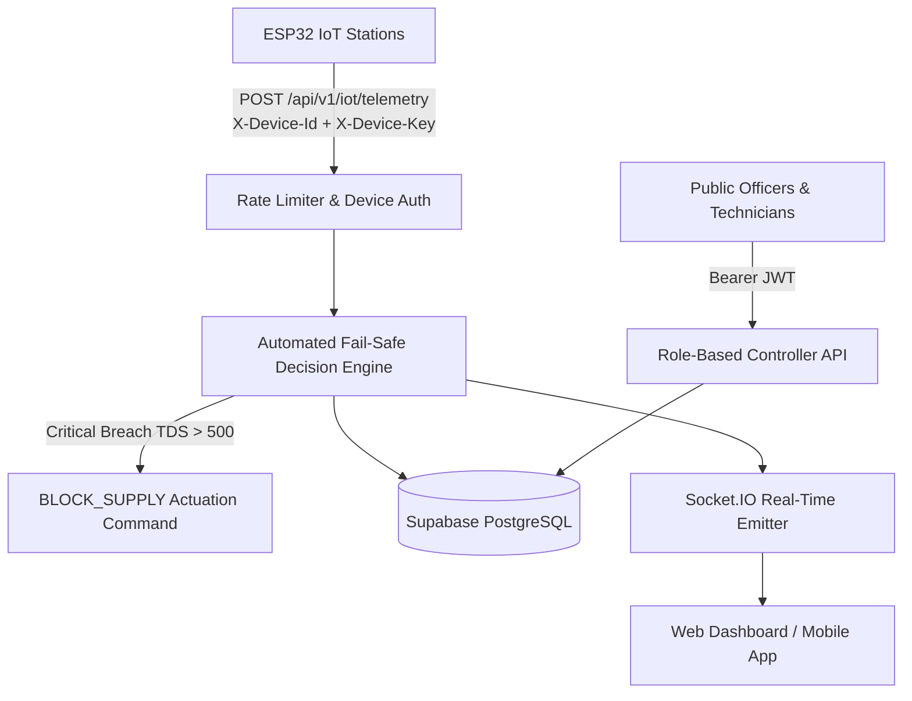

# HydraPure Backend API Documentation

The **HydraPure** backend is an enterprise Node.js/Express service providing real-time telemetry ingestion, water quality analytics, fail-safe purification automation, and administrative oversight for mining-affected communities in Jharkhand, India.

---

## 1. Architecture Overview



### Layer Responsibilities
1. **Routes (`src/routes/`):** Request mapping, Zod input validation, rate limiting, and RBAC middleware.
2. **Controllers (`src/controllers/`):** HTTP transport adapters that format responses and handle errors.
3. **Services (`src/services/`):** Business logic, risk index formulas, anomaly detection, automated fail-safe triggers, and notifications.
4. **Repositories (`src/repositories/`):** Supabase database persistence layer with PostgreSQL schemas and resilient fallback.
5. **Sockets (`src/sockets/`):** Real-time Socket.IO room subscriptions for instant station telemetry and alert broadcasts.
6. **Jobs (`src/jobs/`):** Cron background workers for station connectivity watchdog, alert escalation, and daily compliance summaries.

---

## 2. Authentication & Authorization

### User Authentication (JWT)
Protected endpoints require a Bearer token in the `Authorization` header:
```http
Authorization: Bearer <supabase_jwt_token>
```

#### Roles & Permissions Matrix
| Role | Read Stations | Modify Stations | Override Valves | View Reports | User Admin |
| :--- | :---: | :---: | :---: | :---: | :---: |
| **SUPER_ADMIN** | Yes | Yes | Yes | Yes | Yes |
| **ADMIN** | Yes | Yes | Yes | Yes | Yes |
| **DISTRICT_OFFICER** | Yes | District Only | District Only | District Only | No |
| **STATION_OPERATOR** | Yes | Assigned Only | Assigned Only | No | No |
| **FIELD_TECHNICIAN** | Yes | No | No | Assigned Only | No |
| **VIEWER** | Yes | No | No | Read Only | No |

### Hardware Device Authentication
ESP32 telemetry endpoints require hardware authentication headers:
```http
X-Device-Id: ESP32-JHARIA-01
X-Device-Key: <station_secret_device_key>
```

---

## 3. Core API Endpoints

### 3.1 Authentication (`/api/v1/auth`)
- `POST /login`: Authenticate with email and password. Returns JWT token and user profile.
- `POST /register`: Register a new user account (defaults to `VIEWER`).
- `POST /refresh`: Refresh session token.
- `POST /logout`: Invalidate active session.
- `GET /me`: Fetch authenticated user profile and permissions.

### 3.2 Stations (`/api/v1/stations`)
- `GET /`: List all stations. Filter by `district`, `status`, `page`, `limit`.
- `GET /:id`: Fetch station configuration and specs.
- `GET /:id/live`: Live metrics, stage comparison (raw vs treated), and risk score.
- `GET /:id/history`: Historical water quality measurements.
- `GET /:id/alerts`: Recent alerts for this station.
- `POST /`: Register new station (Admins only).
- `PUT /:id`: Update station configuration.
- `POST /:id/control`: Emergency manual valve actuation (`BLOCK_SUPPLY`, `RESTORE_SUPPLY`).

### 3.3 IoT Hardware Ingestion (`/api/v1/iot`)
- `POST /telemetry`: Ingest single telemetry packet. Evaluates fail-safe rules and returns immediate valve command.
- `POST /telemetry/batch`: Ingest store-and-forward buffered packets from rural offline recovery. Deduplicates automatically.
- `POST /heartbeat`: Hardware diagnostic ping (battery %, solar voltage, signal dBm, firmware).
- `GET /commands`: Polling fallback for ESP32 devices to fetch pending valve actuation commands.

### 3.4 Water Quality (`/api/v1/quality`)
- `GET /latest`: Latest readings across all stations.
- `GET /history`: Filtered time series measurements by date range.
- `POST /manual`: Record manual water sample test conducted by field technicians.
- `POST /assess`: Test water safety calculation for given parameters.

### 3.5 System Alerts (`/api/v1/alerts`)
- `GET /`: List all alerts with filters (`severity`, `status`, `station_id`).
- `GET /stats`: Aggregated alert counts grouped by severity and resolution status.
- `POST /:id/acknowledge`: Mark alert as acknowledged with optional note.
- `POST /:id/resolve`: Resolve alert with mandatory resolution explanation.

### 3.6 Dashboard & Analytics (`/api/v1/dashboard`)
- `GET /summary`: High-level metrics (total stations, safe rate %, water purified, active alerts).
- `GET /map`: Coordinates and live health status for dashboard map view.
- `GET /regions`: District-level breakdown of stations and water safety indexes.

### 3.7 System Health (`/api/v1/health`)
- `GET /health`: Service uptime, memory usage, and Supabase database connection health.

---

## 4. Fail-Safe Automation & Water Safety Standards

### Critical Breach Thresholds (BIS 10500:2012 Compliance)
If treated water exceeds any of the following limits, the automated decision engine instantly executes `BLOCK_SUPPLY`:
- **TDS:** $> 500 \text{ ppm}$
- **Turbidity:** $> 5.0 \text{ NTU}$
- **pH:** $< 6.5 \text{ or } > 8.5$ (Immediate shutoff if $< 5.5$ or $> 9.5$)

### Contamination Risk Index (0 - 100)
- **0 – 25 (LOW):** Potable drinking water meeting national standards.
- **26 – 50 (MODERATE):** Acceptable but requires filter maintenance check.
- **51 – 70 (HIGH):** Non-potable; divert valve activated.
- **71 – 100 (CRITICAL):** Supply shut off; immediate field inspection required.
